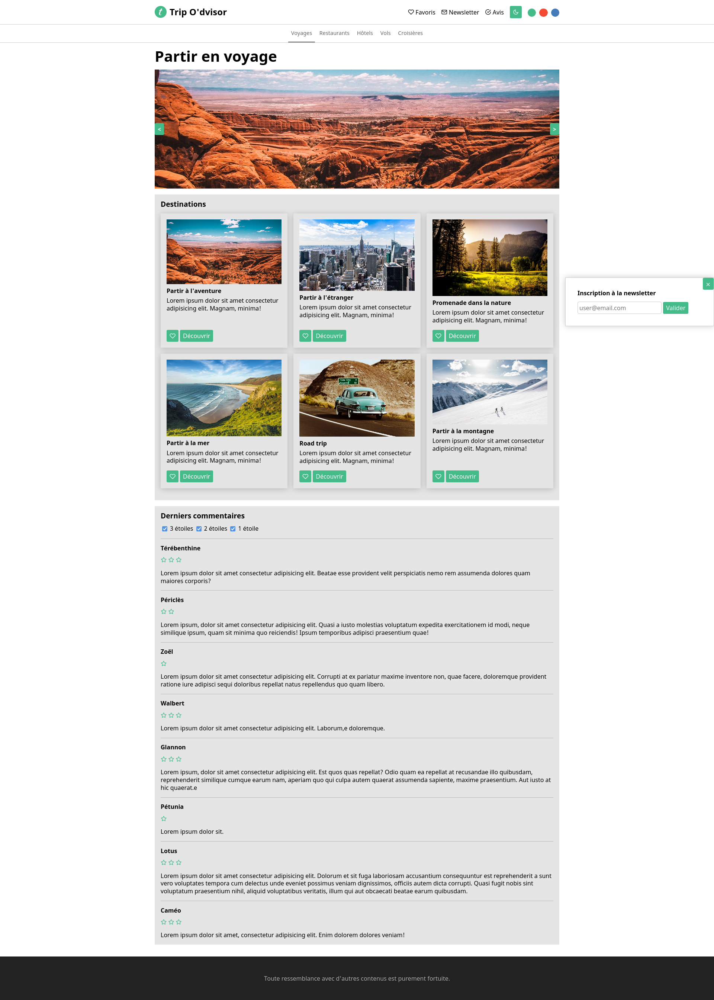
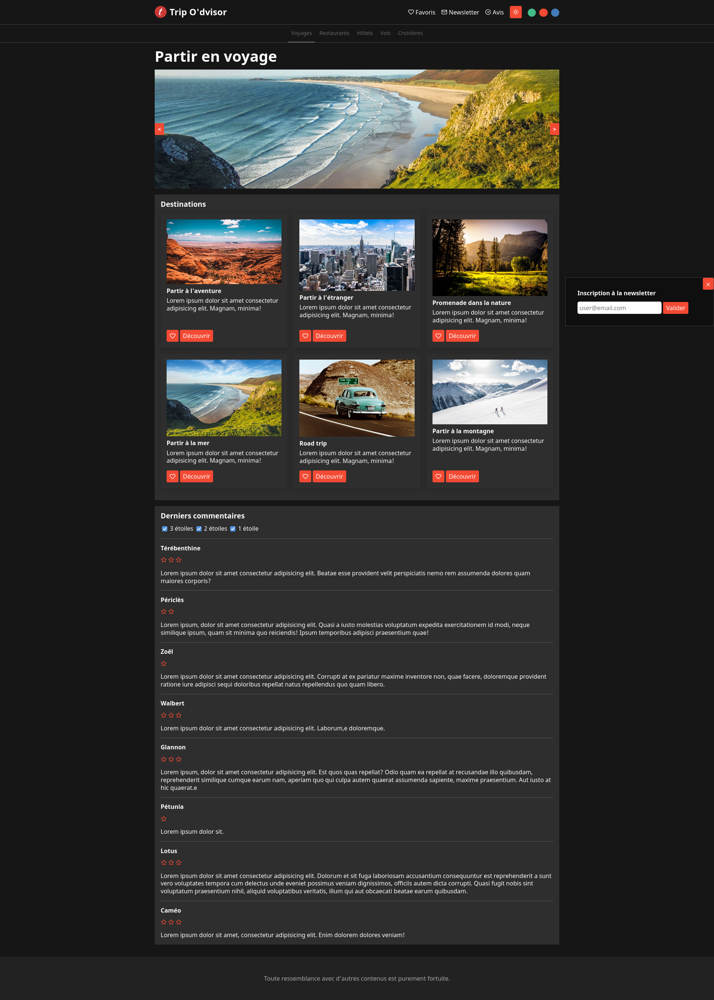

# Permis / Assurances AT2 - CP7 : Develop a dynamic web user interface.

The objective of this exercise is to create elements of dynamic interaction with the user.

## Built with

1. HTML
2. CSS
3. Javascript

## Result

This exercise is designed by the O'clock school.
